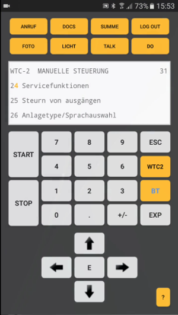

# Bluetooth Display
## Wireless wind turbine controller using an Android phone
### Developed for AN-BONUS (Siemens) WTC2 and WTC3 wind turbines, easily adaptable to others

_!!! Please note - this code will **-NOT-** work out-of-box`*`. First you have to follow the instructions below and fill in some empty spaces. This assumes you know the turbine command instructions and you know how to control the turbine with its standard wired controller. Some basic C and JAVA understanding is also required._

 *I have permission (according to the german law) from my employer to do whatever I please with my creation, however I can not post all of the turbine instructions online - reverse engineered stuff and the like.

##### See the BT Display in action on a 2MW AN-BONUS (Siemens) WTC2 wind turbine:

## Description:

##### BT Display is an advanced wind turbine controller, which has not only all the functions of the original wired controller, but also:
- it works from your smartphone - control the turbine using a typical android phone;
- range is practically everywhere where you can work;
- the cellphone battery usage is minimal - like two full work days without reloading;
- it has **_plenty_** more user features like 
  - phone calls;
  - turbine schematics viewer;
  - notebook with voice control;
  - camera with folder organizer;
  - flashlight;
  - **_LOT_** of macros* (repeatable turbine instructions which gets executed with a single user click)

*The pre-programmed macros are deleted in this open-source release, because of legal concerns, but you can use the very flexible macro framework to create yours to your liking. Just look in the code.

- There are also some nice advanced technical features, like:
  - Two-way authentication with random hashing challenges - both sides test each others authenticity before the real communication is started;
  - Dynamic custom encryption - every session uses different "language";
  - String encryption;
  - APK tampering protection, build in JNI;
  - and of course - MAC binding
  
Yes I know, this is all hackable, my project is just proof of concept with some layered approach to security added mostly for fun.

## How to build
##### Prerequisites:
- Some programmable serial to Bluetooth interface - I build one myself on top of ATMEGA328 and RN41;
- Android Studio with NDK, CMake and LLDB support;
- Some decent C Editor - the firmware is made to be linked and compiled with Arduino IDE which is very convenient, but you can of course link and compile yourself, if you don't like the Arduino's somewhat restrictive license;
- Some basic C and JAVA skills
##### Building
- Read the code and get a basic understanding of the flow - there are plenty of comments almost everywhere;
- Fill in all the gaps - they are marked with `TODO: FILL ME`
- Basically, you need to fill in:
  - your signing config in build.gradle;
  - come up with a key for the hashing function - has to be the same on both sides of course;
  - `init` sequences - two of them - practically arbitrary arrays;
  - your signing hash and android-id for the target device for the JNI layer which takes care of string encryption and tampering protection;
  - or you can completely skip the JNI security layer (not recommended) - then adjust the calls from the java classes;
  - fill in some macros (optional) - or skip this if you don't want to use macros (not recommended - this is a life changer at work);
  - fill in the state machines in the C firmware - two watching for the init sequences and a (somewhat bigger one) to parse the turbine instructions - as said above I can not post this online, you have to figure it out by yourself - HINT: it is actually not that hard as it looks like - one have to just listen and pay close attention to what travels through the wire :)

## Legal
- I live and work in Germany. According to the <a href="https://de.wikipedia.org/wiki/Arbeitnehmererfindung">german law</a> I received permission from my employer to do whatever I please with my creation ( well, it wasn't easy :) );
- My code is released under [MIT](LICENSE) license;
- It also uses the following libraries:
  - <a href="http://www.pjrc.com/teensy/td_libs_AltSoftSerial.html">AltSoftSerial</a>. Licensed under: <a href="https://github.com/PaulStoffregen/AltSoftSerial">MIT</a>;
  - <a href="https://github.com/googlesamples/android-BluetoothChat">Android Bluetooth Chat</a>. Licensed under:<a href="https://github.com/googlesamples/android-BluetoothChat/blob/master/LICENSE"> Apache V 2.0</a>;
  - <a href="https://www.arduino.cc/en/Main/FAQ">Arduino</a>. Licensed under: <a href="https://github.com/arduino/Arduino/blob/master/license.txt">LGPL</a>;
  - <a href="http://www.jcraft.com/jsch/">JSch</a>. Licensed under: <a href="http://www.jcraft.com/jsch/LICENSE.txt">BSD</a>;
  - <a href="http://www.forward.com.au/pfod/SipHashLibrary/index.html">SIP HASH</a>. Licensed under: "This code may be freely used for both private and commercial use. Provide this copyright is maintained."

## 

    <a href="https://vlzware.com">Vladimir Zhelezarov</a> © 2017

